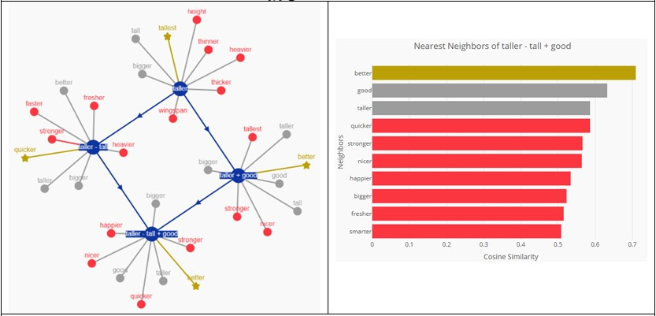

# Language Representations

## Part 1: Building a Spell Checker

### Step 1: Creating a Corpus
**a)** In this step, a text corpus from Project Gutenberg is constructed to be used in this exercise. The corpus will serve as the foundation for extracting statistics during the construction of language models. The preprocessing steps include:  
- Removing special characters and numbers from the texts,  
- Converting uppercase letters to lowercase,  
- Tokenizing based on the “space” character.  

In some cases, such as when context is important for tasks like sentiment analysis, punctuation marks can change the meaning of a sentence (e.g., surprise `!`, sadness `...`). Thus, it is preferable to retain punctuation as it provides useful information.

**b)** To extract better statistical results, the corpus can be enriched with more books. Training on an enriched corpus can lead to:  
- More representative results,  
- Applications that cover a broader range of words, specialized vocabulary, and languages,  
- Reduced bias, as the data may represent different time periods and/or cultures.

---

### Step 4: Building an Edit Distance Transducer
The **L transducer** is based on the Levenshtein distance, which calculates the distance between two strings, i.e., the number of changes (insertions, deletions, substitutions) required to make the strings identical. These changes will be implemented in the exercise's transducer.

#### Formula:
$$
\text{lev}(a, b) =
\begin{cases}
|a| & \text{if } |b| = 0, \\
|b| & \text{if } |a| = 0, \\
\text{lev}(\text{tail}(a), b) & \text{if } |b| = |a|, \\
1 + \min \{
    \text{lev}(\text{tail}(a), b), \,
    \text{lev}(a, \text{tail}(b)), \,
    \text{lev}(\text{tail}(a), \text{tail}(b))
\} & \text{otherwise.}
\end{cases}
$$

#### The transducer L maps:
- Each character to itself with weight 0 (no edit),  
- Each character to 𝜀 (epsilon) with weight 1 (deletion),  
- 𝜀 (epsilon) to each character with weight 1 (insertion),  
- Each character to any other character with weight 1 (substitution).

Taking the shortest path in this transducer results in the input word unchanged, as each character is mapped to itself with a weight of 0.

#### Additional Edits:
- Transposition of adjacent characters,  
- Substitutions based on the word’s context.

#### Frequency-Based Weights:
If data on the frequency of specific typos were available (e.g., typing “,” instead of “M” or spelling errors like “e” instead of “i”), this information could be incorporated by adjusting the weights:
- Lower weights for more frequent errors,  
- Higher weights for rarer errors.

#### Visualization:
The `fstdraw` command can be used to visualize the L transducer. An example visualization for a subset of characters (a, b, and c) is shown in **Figure 1**.

    

---

### Step 5: Constructing a Lexicon Acceptor
The **V acceptor** accepts any word that belongs to the lexicon, which is essentially the union of all automata that accept the words in the vocabulary. An example visualization for a lexicon with 5 words is shown in **Figure 2**.

    

#### Optimization Functions:
1. **fstrmepsilon**: Removes transitions where the input and output labels are 𝜀. This simplifies the FST and reduces its size. In **Figure 3**, there is no visible change from **Figure 2** since there were no `<epsilon>:<epsilon>` transitions.  

    

2. **fstdeterminize**: Converts the FST from a non-deterministic automaton (NFA) to a deterministic automaton (DFA). This ensures that from each state, there is a unique edge for each input label. For example, if we have the words “the” and “tragedie,” they share the same initial state and branch out depending on the input (**Figure 4**). This ensures consistent output for a given input.  

    

3. **fstminimize**: Minimizes the number of states in the FST. This significantly reduces the FST’s size, making it faster to traverse and use. The result is shown in **Figure 5**.

    

---

## Efficiency of Deterministic Automata
The traversal complexity of a DFA is $$\( O(n) \)$$, where $$\( n \)$$ is the length of the input string. This is because a DFA always has a unique transition for each input symbol and state, enabling linear processing of the input string.

In contrast, the traversal complexity of a non-deterministic automaton is $$\( O(2^n) \)$$, where $$\( n \)$$ is the number of states, as multiple paths may need to be explored to find the correct output.

### Step 6: Orthograph Construction
While the number of edges in a DFA is typically higher than in an NFA (since each state must have a unique transition for every input symbol), DFAs are more efficient for input processing.

We execute the function `fstarcsort`, which sorts the edges of $$\(L\)$$ and $$\(V\)$$ based on output and input labels, respectively. Subsequently, we perform `fstcompose` to construct the minimum edit distance spell checker $$\(S\)$$. This transducer corrects words without utilizing linguistic information, aiming to perform the minimum number of edits to the input word. 

The behavior of the transducer varies depending on the weights assigned to edits:
- **Equal weights for edits**: All possible words with the same number of edits have equal likelihood, as there is no preference for any specific edit.
- **Different weights for edits**: Certain words become more likely than others. For example, with the configuration $$\( \text{cost}(\text{insertion}) = \text{cost}(\text{deletion}) = 1 \)$$ and $$\( \text{cost}(\text{substitution}) = 1.5 \)$$, shorter words contained within the erroneous input are more likely to appear compared to substitutions of characters.

### Results
Specific results are shown in **Table 1**.

| Word to Correct | Possible Words              |
|------------------|-----------------------------|
| **cit**          | cut, cin, sit, hit, fit    |
| **cwt**          | lot, cas, cap, cut, cat    |

Table 1: Correction Results

Despite both words having the same distance from "cut", the results differ significantly because "cit" is closer to other words in the vocabulary compared to "cwt".

---

### Step 7: Testing the Spell Checker
Next, we attempt to correct words from the file `spell_test.txt`. Results for some test words are shown in **Table 2**.

| Word to Correct | Correct Word | Possible Words                       |
|------------------|--------------|--------------------------------------|
| **contentid**    | contented    | content, contented, contend          |
| **begining**     | beginning    | begging, beginning                   |
| **proble**       | problem      | prone, problem                       |
| **dirven**       | driven       | dirge, given, driven                 |
| **poety**        | poetry       | poet, piety, poetry                  |

Table 2: Top Three Most Likely Words for Correction

By calculating accuracy for the top prediction, we achieve a result of **46.15%**. Errors in corrections occur either because:
1. The word does not exist in the dictionary (e.g., *transportability*, *respectability*), or
2. The algorithm finds an equally weighted path to another word (e.g., *localy* → *local*).

### Prediction Function
The prediction was performed using the function `predict_word(word, mode, transducer, verbose)`, which generates a `.txt` file containing transitions for the acceptor of the incorrect word. It then executes the `cpredict.sh` script in bash, which performs the following operations:
- Compiles the binary representation of the incorrect word (`wrong_word.bin.fst`),
- Composes it with the spell checker,
- Computes the shortest path on the composed graph,
- Removes epsilon transitions using `fstrmepsilon`,
- Reorders IDs from higher to lower using `fsttopshort`,
- Outputs the results using `fstprint`,
- Visualizes the graph of the corrected word using `fstdraw`.

The results from `fstprint` are then parsed to produce a table of predicted words. The function parameters are:
- **word**: The word to correct,
- **mode**: `0` for retrieving the top 5 predictions, `1` for the top prediction,
- **transducer**: The spell checker to use for prediction,
- **verbose**: `1` to display results.

     

---

### Step 8: Calculating Edit Costs
In this step, we refine the vanilla Levenshtein model by extracting frequency data for specific edits from `wiki.txt`. The frequencies are converted to weights by taking the negative decimal logarithm of their probabilities.

| Word to Correct | Possible Words                            |
|------------------|-------------------------------------------|
| **cit**          | city, sit, it, cut, clit                 |
| **cwt**          | cow, caw, wet, wit                       |

Table 3: Results for the Updated Levenshtein Model

| Word to Correct | Correct Word | Possible Words                       |
|------------------|--------------|--------------------------------------|
| **contentid**    | contented    | content, contented, contend          |
| **begining**     | beginning    | beginning, beginnings                |
| **proble**       | problem      | probable, robe, parable, problems    |
| **dirven**       | driven       | dived, divine, dive, driven          |
| **poety**        | poetry       | poets, piety, poetry, poet           |

Table 4: Results for the Updated Levenshtein Model

Accuracy for the top prediction improves to **58.97%**, indicating a **10% improvement** due to the inclusion of edit frequency data. Predicted words differ significantly from the vanilla Levenshtein model since certain transitions are now preferred over others.

---

### Step 9: Introducing Word Frequency (Unigram Word Model)
To further enhance the acceptor $$\(V\)$$, we incorporate word frequency information from a corpus. We construct an acceptor $$\(W\)$$, consisting of a single state, which maps each word to itself with a weight corresponding to the negative logarithm of its frequency. The spell checker $$\(LVW\)$$ is then created by composing the Levenshtein transducer $$\(L\)$$ with both the vocabulary acceptor $$\(V\)$$ and the language model $$\(W\)$$.

| Word to Correct | Possible Words (LVW)                      |
|------------------|-------------------------------------------|
| **cit**          | his, in, it                              |
| **cwt**          | the, but, not, it                        |

Table 5: Results for Spell Checker \(LVW\)

| Word to Correct | Correct Word | Possible Words                       |
|------------------|--------------|--------------------------------------|
| **contentid**    | contented    | continued, contented, contend        |
| **begining**     | beginning    | being, beginning                     |
| **proble**       | problem      | people                               |
| **dirven**       | driven       | even, in, given                      |
| **poety**        | poetry       | of, poet, they, the, not             |

Table 6: Results for Spell Checker $$\(LVW\)$$

Accuracy for the top prediction drops to **35.9%**, primarily due to the introduction of significant bias towards the dictionary, favoring incorrect paths even when they require multiple edits.

     

---

### Step 10: Evaluation of Spell Checkers
**Table 7** compares the accuracy of various spell checkers.

| Spell Checker | Accuracy |
|---------------|----------|
| **LV**        | 58.15%   |
| **LVW**       | 43.49%   |
| **EV**        | 67.78%   |
| **EVW**       | 66.30%   |

Table 7: Comparative Results for Spell Checkers

The inclusion of edit frequency information improved performance, while incorporating word frequency data introduced significant bias, reducing overall accuracy.

## Part 2: Familiarization with W2V

### Step 11: Extracting Word2Vec Representations

A more advanced method for representing words is through the use of the Word2Vec model, which creates word embeddings derived from training a neural network that predicts a word based on its context within a sliding window. This allows for feature extraction from words, representing them as numerical vectors.

For this application, we use the **Gensim** library on the Gutenberg corpus to extract custom word embeddings. The neural network consists of a single layer (CBOW model) and is used to produce 100-dimensional word embeddings within a context window of 5 words, trained over 1,000 epochs. The training is conducted on a tokenized corpus, represented as a list of lists of tokenized sentences. Additionally, pretrained GoogleNews vectors are used for comparison.

### Semantic Similarity of Words
**Table 8** shows the semantically similar words derived from the above process for selected examples.

| Initial Word | Semantically Similar Words | Gutenberg Vectors             | GoogleNews Vectors        |
|--------------|-----------------------------|-------------------------------|---------------------------|
| **bible**    | surplice, incitement, headship | Bible, scriptures, scripture |
| **book**     | written, chronicles, jasher   | tome, books, memoir          |
| **bank**     | pool, ridge, table            | banks, banking, Bank         |
| **water**    | waters, river, rivers         | potable_water, Water, sewage |

**Table 8: Semantically Similar Words**

### Observations
The results from the Gutenberg vectors indeed show semantically similar words. However, the results are not optimal for certain words such as *bank* and *bible*, due to significant dependence on the training set. Since the GoogleNews vectors are produced from training a Word2Vec model on an extensive dataset, they demonstrate better results. Nevertheless, differences in tokenization result in words such as *Bible*, *Bank*, *potable_water*, and *Water* appearing in the output.

---

### Adjusting the Context Window

#### Semantic Analogies
Another property of Word2Vec is its ability to express semantic analogies algebraically. A semantic analogy is defined as follows: given two pairs of concepts \((a, b)\) and \((c, d)\), there exists a semantic analogy if the statement *“a is to b as c is to d”* holds true. Mathematically, this can be represented as:

$$\[
w_{\text{analogical}} = w2v(a) - w2v(b) + w2v(d)
\]$$

**Table 9** displays the results for some triplets.

| Triplet          | Word with Maximum Similarity | Gutenberg Vectors | GoogleNews Vectors |
|-------------------|-----------------------------|-------------------|---------------------|
| girls, queen, kings | girls                     | Boys              |
| good, taller, tall  | taller                    | Better            |
| france, paris, london | france                 | Britain           |

**Table 9: Words Derived from Vector Analogy**

### Observations
The custom word embeddings are not trained on a sufficiently large dataset to understand the conceptual relationship expressed in the analogy operation, resulting in incorrect outputs. On the other hand, the GoogleNews vectors are able to grasp the context *“a is to b as c is to d”* and return accurate results.
## Step 14: Word Embeddings Visualisation
We present results for triplets: {france, paris, london}, {girls, queen, kings}, {good, taller, tall}

     

     

     

At this stage, each word embedding consists of 100 dimensions. To visualize these embeddings and observe relationships between words, we need a dimensionality reduction method. For this purpose, we use TensorFlow's online tool to visualize the data in 3 dimensions using **Principal Component Analysis (PCA)**. Additionally, we apply the **T-SNE** algorithm, which converts point similarities into joint probability distributions and attempts to minimize the divergence between these probabilities for low-dimensional embeddings and the original high-dimensional data.

### Observations

#### PCA Visualization for the Word "Country"
In **Figure 9**, we observe the visualization of word embeddings for the word **"country"** (left) and its closest semantically similar words (right) using PCA. The closest words to "country" are **land**, **place**, and **city**, which are indeed semantically related.

     

#### PCA Visualization for the Word "Bible"
In **Figure 10**, the corresponding results for the word **"bible"** are less satisfactory. 

     

Both **Figures 9 and 10** utilize PCA for dimensionality reduction. Using **T-SNE**, the results are similar.

---

**Figure 9:** Visualization of word embeddings for the word "country" (left) and its closest semantically similar words (right) using PCA.  
**Figure 10:** Visualization of word embeddings for the word "bible" (left) and its closest semantically similar words (right) using PCA.

## Step 14: Sentiment Analysis with Word2Vec Embeddings

The average of the Word2Vec vectors for each word in a sentence can provide a representation of the sentence, known as the **Neural Bag of Words (NBOW)**. In this step, we use these representations for sentiment analysis on movie reviews.

We construct two NBOWs: one from the custom embeddings created from the Gutenberg corpus and one from the GoogleNews vectors. The NBOWs are built by calculating the average of the word embeddings in a sentence and concatenating them into an array. For **Out-Of-Vocabulary (OOV)** words, we add a zero vector. Classification was performed using **Logistic Regression** with the solver set to `LBFGS` for 200 iterations.

The results for the two NBOWs are shown in **Table 11**:

| Model              | Accuracy   |
|---------------------|------------|
| Custom Embeddings   | 74.8%      |
| GoogleNews Vectors  | 82.53%     |

**Table 11: Results for the Two NBOWs**

### Observations
The model using GoogleNews embeddings demonstrated better performance. Generally, to improve the model's performance, it would be ideal to have access to more data with a wide variety of contexts. This is crucial since the same words can carry different emotional connotations depending on the context. Additionally, incorporating punctuation marks, such as exclamation points, could further enhance the model's performance.
