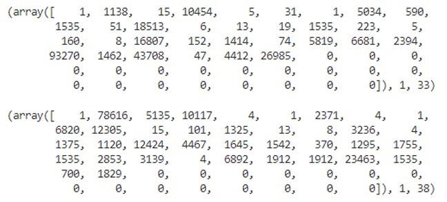
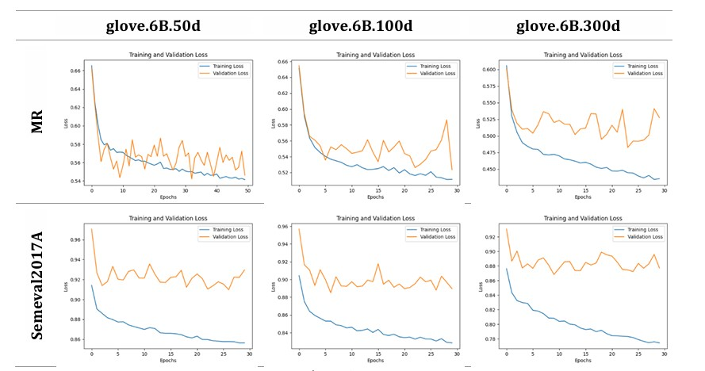

## Text Processing and Categorization Using Deep Neural Networks and Large Language Models

### Objective
The goal is to implement a model for processing and categorizing text using **Deep Neural Networks (DNNs)** and **pre-trained Large Language Models (LLMs)**.

---


### 1. Data Preprocessing

**1.1 Label Encoding**  
For preparation, the steps were performed on the MR dataset (Sentence Polarity Dataset). Initially, to utilize the dataset labels, we need to convert them into numerical form. We used the **LabelEncoder** from `scikit-learn` and applied `fit` and `transform` on all the dataset labels. Below are the first 10 labels and their encoding:

Before encoding: ['positive', 'positive', 'positive', 'positive', 'positive', 'positive', 'positive', 'positive', 'positive', 'positive']

After encoding:  [1, 1, 1, 1, 1, 1, 1, 1, 1, 1]

**1.2 Tokenization**  
To encode the data in a format suitable for processing by the network, we first split sentences into sequences of tokens. We used `RegexpTokenizer` from `nltk.tokenize` for tokenization, as it ignores punctuation marks. Below are the first two training examples:

Before tokenization: 

'the rock is destined to be the 21st century\'s new " conan " and 
that he\'s going to make a splash even greater than arnold 
schwarzenegger , jean-claud van damme or steven segal .' - 1 - 

'the gorgeously elaborate continuation of " the lord of the rings " 
trilogy is so huge that a column of words cannot adequately 
describe co-writer/director peter jackson\'s expanded vision of j . 
r . r . tolkien\'s middle-earth .'

After tokenization: 

['the', 'rock', 'is', 'destined', 'to', 'be', 'the', '21st', 
'century', 's', 'new', 'conan', 'and', 'that', 'he', 's', 'going', 
'to', 'make', 'a', 'splash', 'even', 'greater', 'than', 'arnold', 
'schwarzenegger', 'jean', 'claud', 'van', 'damme', 'or', 'steven', 
'segal'] 

['the', 'gorgeously', 'elaborate', 'continuation', 'of', 'the', 
'lord', 'of', 'the', 'rings', 'trilogy', 'is', 'so', 'huge', 
'that', 'a', 'column', 'of', 'words', 'cannot', 'adequately', 
'describe', 'co', 'writer', 'director', 'peter', 'jackson', 's', 
'expanded', 'vision', 'of', 'j', 'r', 'r', 'tolkien', 's', 
'middle', 'earth']  

**1.3 Word Encoding**  
Finally, tokens are converted into numbers based on the embeddings used. The `load_word_vectors` function accepts embeddings as input and returns a dictionary with the ID of each word. To ensure uniform vector lengths, zero padding is applied to match the length of the longest sequence in the dataset. Below are the first two encoded examples:

After encoding:  

<div style="display: flex; justify-content: center; align-items: center; gap: 2rem; margin: 0 auto;">
     
</div>

---

### 2. Model Architecture

**2.1 Embedding Layer**  
The embedding layer is defined based on the dimensions of the pre-trained embedding matrix. Using PyTorch, we initialize weights from the pre-trained word embeddings and freeze them by setting `requires_grad=False`. Pre-trained embeddings provide a solid initialization to avoid overfitting during training on our dataset. The embeddings are not trained further to preserve their original structure in the embedding space.

**2.2 Output Layer(s)**  
We add a hidden layer with 32 units and a **ReLU** activation function. Non-linear activation functions enable the network to generalize properly and develop complex relationships for the desired output. Without them, multiple linear functions would yield a linear output, which is insufficient for solving complex problems.

**2.3 Forward Pass**  
We implement the necessary transformations and pass the data through the network’s forward pass.  
The centroid representation provides a general idea of a sentence vector’s position in space and its content. While this transformation allows sentence classification into dataset classes (positive, negative), taking the average can overshadow fine details and context-dependent variations in meaning.

---

### 3. Training Process

**3.1 DataLoaders**  
Mini-batches are used during training to provide the network with enough information before weight updates. Small mini-batches can lead to overfitting due to frequent updates, while large mini-batches may lack sufficient updates, resulting in poor generalization. Typically, an appropriate batch size is chosen to balance convergence speed and correct relationship formation.  
**Shuffling** is applied to prevent the model from developing sequence-based relationships, ensuring better generalization and avoiding overfitting.

---

### Results

The results for two datasets and three embedding dimensionalities are summarized below:

| Embedding Type     | Dataset         | Accuracy | Recall | F1 Score |
|---------------------|-----------------|----------|--------|----------|
| **glove.6B.50d**   | MR              | 0.71     | 0.71   | 0.71     |
| **glove.6B.100d**  | MR              | 0.72     | 0.72   | 0.72     |
| **glove.6B.300d**  | MR              | **0.75** | **0.75** | **0.75** |
| **glove.6B.50d**   | Semeval2017A    | 0.57     | 0.54   | 0.54     |
| **glove.6B.100d**  | Semeval2017A    | 0.59     | 0.57   | 0.57     |
| **glove.6B.300d**  | Semeval2017A    | **0.60** | **0.58** | **0.58** |

Increasing embedding dimensionality captures more information, resulting in better model performance but slower training.
<div style="display: flex; justify-content: center; align-items: center; gap: 2rem; margin: 0 auto;">
     
</div>
---

### 4. Categorization Using Large Language Models (ChatGPT)

Using ChatGPT for categorization, we selected 20 texts from each category in both datasets.  
- **MR Dataset**: ChatGPT made 1 error out of 40 examples, achieving an **accuracy of 0.975**. The misclassification occurred on the sentence *“effective but too-tepid biopic”*. When asked, ChatGPT responded:
  > *“The model might have focused on the word ‘tepid,’ which carries a negative connotation, rather than considering the overall positive sentiment of the text.”*

- **Semeval2017A Dataset**: ChatGPT achieved an **accuracy of 0.82** (11 errors out of 60 examples) for this dataset, which required categorization into three classes instead of two.

**Insights from ChatGPT:**  
Using appropriate prompts, we gained information about its categorization process. For example:
> *“Some words act as sentiment indicators, carrying emotional or neutral connotations that guide text sentiment classification. Examples include:*  
> - **Positive indicators**: *love, great, amazing, wonderful, excellent*  
> - **Negative indicators**: *hate, terrible, awful, disappointing, horrible*  
> - **Neutral indicators**: *fact, information, data, report, analysis, study*  
> *These words help determine overall sentiment.”*


---

## 5. Pre-Trained Transformers

### Performance Metrics on MR Dataset

| **Model**                            | **Test Set Accuracy** | **Test Set Recall** | **Test Set F1-Score** |
|--------------------------------------|-----------------------|---------------------|------------------------|
| siebert/sentiment-roberta-large-english | 0.93                  | 0.93                | 0.93                   |
| distilbert-base-uncased-finetuned-sst-2-english | 0.89                  | 0.89                | 0.89                   |
| bert-base-uncased                   | 0.5                   | 0.5                 | 0.33                   |

*Table 11: Metrics for pre-trained models on the MR dataset*

The Siebert and DistilBERT models outperform the rest as they are fine-tuned for sentiment analysis tasks.

### Performance Metrics on Semeval Dataset

| **Model**                            | **Test Set Accuracy** | **Test Set Recall** | **Test Set F1-Score** |
|--------------------------------------|-----------------------|---------------------|------------------------|
| mrm8488/distilroberta-finetuned-financial-news-sentiment-analysis | 0.51                  | 0.4                  | 0.36                   |
| cardiffnlp/twitter-roberta-base-sentiment | 0.72                  | 0.72                | 0.72                   |
| oliverguhr/german-sentiment-bert    | 0.51                  | 0.43                | 0.43                   |

*Table 12: Metrics for pre-trained models on the Semeval dataset*

---

## 6. Fine-Tuning

### Performance Metrics After Fine-Tuning on MR Dataset

| **Model**                            | **Test Set Accuracy** |
|--------------------------------------|-----------------------|
| siebert/sentiment-roberta-large-english | *1*                   |
| distilbert-base-uncased-finetuned-sst-2-english | 0.85                  |
| bert-base-uncased                   | 0.81                  |

*Table 13: Accuracy for pre-trained models (MR dataset) after fine-tuning*  
*Note:* The Siebert model could not be fine-tuned due to memory constraints, but as it is already fine-tuned for sentiment analysis, no significant improvement was expected. Overfitting was likely to occur.

### Performance Metrics After Fine-Tuning on Semeval Dataset

| **Model**                            | **Test Set Accuracy** |
|--------------------------------------|-----------------------|
| mrm8488/distilroberta-finetuned-financial-news-sentiment-analysis | 0.62                  |
| cardiffnlp/twitter-roberta-base-sentiment | 0.65                  |
| oliverguhr/german-sentiment-bert    | 0.46                  |

*Table 14: Accuracy for pre-trained models (Semeval dataset) after fine-tuning*

**Observations:**  
- Fine-tuning significantly improved the performance of models like BERT that were not initially trained for sentiment analysis (30% improvement).  
- Models already fine-tuned for sentiment analysis experienced overfitting, as training loss dropped while validation loss increased.  

Fine-tuning is a critical process to specialize a large language model (LLM) for specific applications.

---

## 7. ChatGPT's Code Explanation, Evaluation, and Refactoring

### Code Explanation

ChatGPT was asked to explain the following code:  
*"Let’s build GPT: from scratch, in code, spelled out"*.

#### ChatGPT's Explanation:
The provided Python code is an implementation of a GPT-based language model trained on the "tinyshakespeare" dataset. It preprocesses the text by encoding characters into numerical values and splits the data into training and validation sets. The model is implemented as a class, **BigramLanguageModel**, and employs self-attention and matrix multiplication to learn token dependencies. The training process utilizes the AdamW optimizer with a cross-entropy loss function. Ultimately, the model generates coherent text based on learned Shakespearean patterns.

### Code Evaluation

- **Structure:** The implementation is concise and well-structured, with clear definitions for the model, data preprocessing, and training loops.  
- **Effectiveness:** The model uses advanced concepts like self-attention and layer normalization, providing an efficient demonstration of GPT architecture.  
- **Usability:** It is an excellent resource for understanding GPT model design and text generation.  

### Modularity of the Code

The code exhibits a high degree of modularity with separate components for:
- **Data Preprocessing**
- **Model Definition**
- **Training**
- **Evaluation**

This design enhances readability, reusability, and collaboration potential. It allows for easy adaptation to other datasets or tasks.

### Refactored Code

ChatGPT provided a refactored version of the code for improved organization and modularity:

```python
import torch
import torch.nn as nn
from torch.nn import functional as F

torch.manual_seed(1337)

class LanguageModel(nn.Module):
    def __init__(self, vocab_size, n_embd, n_head, n_layer, dropout):
        super(LanguageModel, self).__init__()
        self.token_embedding_table = nn.Embedding(vocab_size, n_embd)
        self.transformer = nn.Transformer(n_embd, n_head, n_layer, dropout)
        self.linear = nn.Linear(n_embd, vocab_size)

    def forward(self, idx, targets=None):
        embeddings = self.token_embedding_table(idx)
        logits = self.transformer(embeddings)
        logits = self.linear(logits)

        loss = None if targets is None else F.cross_entropy(
            logits.view(-1, logits.size(-1)), targets.view(-1)
        )
        return logits, loss

    def generate(self, idx, max_new_tokens):
        embeddings = self.token_embedding_table(idx)
        return self.transformer.generate(embeddings, max_new_tokens)

vocab_size = len(chars)
model = LanguageModel(vocab_size, n_embd=64, n_head=4, n_layer=4, dropout=0.0)
model.to(device)

optimizer = torch.optim.AdamW(model.parameters(), lr=learning_rate)

def train(model, optimizer, max_iters, eval_interval):
    for step in range(max_iters):
        model.train()
        optimizer.zero_grad()
        X, Y = get_batch('train')
        logits, loss = model(X, Y)
        loss.backward()
        optimizer.step()
        if step % eval_interval == 0:
            model.eval()
            train_loss = estimate_loss('train')
            val_loss = estimate_loss('val')
            print(f"Step: {step}, Train Loss: {train_loss:.4f}, Val Loss: {val_loss:.4f}")

train(model, optimizer, max_iters, eval_interval)
start_token = torch.tensor([stoi['<START>']], dtype=torch.long).unsqueeze(0).to(device)
generated_sequence = model.generate(start_token, max_new_tokens=100)
generated_text = decode(generated_sequence[0].tolist())
print("Generated Text:")
print(generated_text)
```

Observations on Refactoring:
The LanguageModel class encapsulates model architecture, making the code more organized.
Separate functions for training and evaluation enhance clarity.
Refactored code provides better maintainability and extensibility, allowing easy integration into other projects.